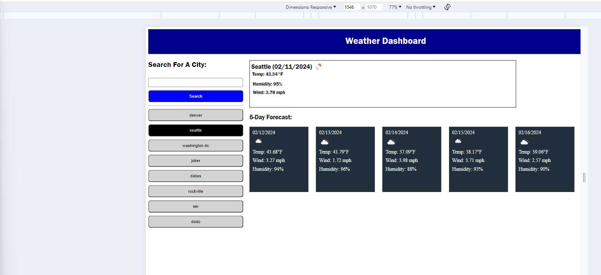

# weather-forecast

## Description
Application which shows the weather forecast for the next day, and a five day forecast for the next five days. User can search for a city, and if the city is found then the forecast is shown for that city. In addition, if the city is found a button is shown under the search with the city name that was found for a quick search on the weather for that city. If the city was not found, a city not found message is shown at the top of the screen. 

## Installation
N/A

## Credits
https://api.openweathermap.org/

## Usage
1. Enter city name for forecast in search box and hit enter
2. View City forecast for next day and five day forecast
3. If city is not found a "City not found" message is displayed at the top
4. If city is found, it is saved and a button is displayed for quick search on that city

## Website Link
https://milindmjoshi.github.io/weather-forecast/

## License
[MIT License](https://opensource.org/license/mit/)
